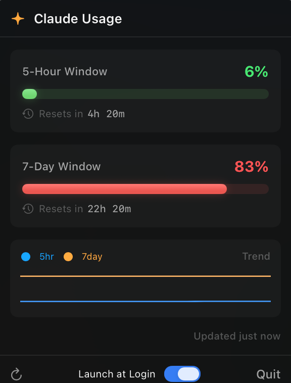

# ClaudeUsageBar

A lightweight macOS menu bar app that shows your Claude API usage limits at a glance.


## Screenshots

| Menu Bar | Popover |
|----------|---------|
|  |  |

## Overview

ClaudeUsageBar lives in your menu bar and displays your current Claude 5-hour window usage as a percentage alongside the time remaining until reset. Click it to see a popover with detailed breakdowns of your 5-hour and 7-day usage windows, color-coded progress bars, live countdowns, and a usage trend sparkline.

It reads the OAuth token directly from the macOS Keychain (shared with Claude Code) and calls the Anthropic usage API independently — no need for Claude Code to be running.

### Menu Bar

The menu bar shows a color-coded sparkle icon, your 5-hour window percentage, and the reset countdown. The sparkle icon changes color based on your highest usage: green (< 50%), yellow (50–75%), red (> 75%).

### Popover

Clicking the icon opens a popover with:

- **5-Hour Window** — usage percentage, progress bar, and live reset countdown (ticks every second)
- **7-Day Window** — usage percentage, progress bar, and live reset countdown
- **Usage trend sparkline** — mini chart showing recent 5-hour (blue) and 7-day (orange) usage history
- **Last updated** timestamp with stale data indicator
- **Refresh** button for immediate update
- **Launch at Login** toggle
- **Quit** button

Each usage window is displayed in a card-style section with a subtle background. Progress bars glow with color-matched shadows.

Progress bars are color-coded:
| Usage | Color |
|-------|-------|
| < 50% | Green |
| 50–75% | Yellow |
| > 75% | Red |

### Smart Features

- **Adaptive refresh rate** — polls every 30s when usage is high (≥ 75%), every 60s normally, every 2 minutes when low (< 25%). Balances freshness and battery.
- **Usage notifications** — system alerts at 80% and 90% thresholds so you know before hitting limits
- **Token caching** — caches the OAuth token for 5 minutes instead of reading Keychain on every refresh
- **Automatic retry** — retries once on transient network errors and automatically refreshes the token on auth failures
- **Persistent state** — saves last known data to disk so the app shows usage instantly on relaunch instead of a loading spinner
- **Graceful error handling** — on refresh failure, shows stale data with an error banner instead of replacing everything with an error screen

## Prerequisites

- **macOS 13.0** (Ventura) or later
- **Xcode 16+** with command-line tools
- **XcodeGen** — `brew install xcodegen`
- **Claude Code** — must be logged in at least once (for the OAuth token in Keychain)

## Install

### From Source

```bash
git clone https://github.com/sam-pop/ClaudeUsageBar.git
cd ClaudeUsageBar
make install
```

This builds a Release binary and copies it to `/Applications/ClaudeUsageBar.app`.

### Build Only

```bash
make build
```

The `.app` bundle is output to `build/Release/ClaudeUsageBar.app`.

### Run (build + launch)

```bash
make run
```

## Usage

1. **Launch the app** — it appears in your menu bar as `✦ --% · Xh Xm`
2. **Allow Keychain access** — on first run, macOS will prompt you to allow access to the "Claude Code-credentials" keychain item. Click **Always Allow**.
3. **Allow notifications** — the app will request permission to send usage alerts at 80% and 90%.
4. The app fetches your usage immediately and adapts its refresh rate based on current usage.
5. Click the menu bar icon to see the full breakdown with sparkline trends.

### Makefile Targets

| Target | Description |
|--------|-------------|
| `make generate` | Generate `.xcodeproj` from `project.yml` |
| `make build` | Generate project + build Release binary |
| `make run` | Build + launch the app |
| `make install` | Build + copy to `/Applications` |
| `make clean` | Remove build artifacts and generated project |

## How It Works

```
┌─────────────┐     SecItemCopyMatching      ┌──────────────────┐
│   Keychain   │ ──────────────────────────▶  │ KeychainService  │
│  (Claude     │   OAuth token (sk-ant-oat01) │                  │
│   Code creds)│                              └────────┬─────────┘
└─────────────┘                                        │
                                                       ▼
                                              ┌──────────────────┐
                                              │   Token Cache     │
                                              │   (5min TTL)      │
                                              └────────┬─────────┘
                                                       │
                                                       ▼
┌─────────────┐     GET /oauth/usage          ┌──────────────────┐
│  Anthropic   │ ◀─────────────────────────── │ UsageAPIService  │
│  API         │ ─────────────────────────▶   │ (auto-retry)     │
└─────────────┘   JSON {five_hour, seven_day} └────────┬─────────┘
                                                       │
                                                       ▼
                                              ┌──────────────────┐
                                              │  UsageViewModel  │
                                              │  (adaptive timer,│
                                              │   notifications, │
                                              │   persistence)   │
                                              └────────┬─────────┘
                                                       │
                                                       ▼
                                              ┌──────────────────┐
                                              │  MenuBarExtra     │
                                              │  ✦ 42% · 2h 15m  │
                                              │  ┌────────────┐  │
                                              │  │  Popover    │  │
                                              │  │  + sparkline│  │
                                              │  └────────────┘  │
                                              └──────────────────┘
```

## Project Structure

```
ClaudeUsageBar/
├── project.yml                    # XcodeGen project spec
├── Makefile                       # Build commands
├── ClaudeUsageBar/
│   ├── ClaudeUsageBarApp.swift    # @main — MenuBarExtra entry point
│   ├── Info.plist                 # LSUIElement=true (no dock icon)
│   ├── ClaudeUsageBar.entitlements
│   ├── Assets.xcassets/
│   ├── Models/
│   │   └── UsageData.swift        # API response + view model + history
│   ├── Services/
│   │   ├── KeychainService.swift  # Keychain token extraction
│   │   └── UsageAPIService.swift  # Anthropic usage API client + retry
│   ├── ViewModels/
│   │   └── UsageViewModel.swift   # State, adaptive timer, notifications, persistence
│   └── Views/
│       ├── MenuBarLabel.swift     # Color-coded ✦ + percentage + countdown
│       ├── ProgressBarView.swift  # Animated gradient bar with glow
│       ├── SparklineView.swift    # Mini trend graph (5hr + 7day)
│       ├── UsageSectionView.swift # Card section with bar + live countdown
│       └── UsagePopoverView.swift # Full popover layout
```

## Design Decisions

| Decision | Choice | Why |
|----------|--------|-----|
| API access | Direct API call | Independent of Claude Code running |
| Keychain | `SecItemCopyMatching` | No subprocess spawning |
| Token cache | 5-minute TTL | Avoid Keychain reads every refresh |
| Popover | `.window` style | Rich SwiftUI views (progress bars, sparklines) |
| Build | XcodeGen | Human-readable, diffable project config |
| Refresh | Adaptive 30s–120s | Faster when usage is high, slower when low |
| Retry | 1 automatic retry | Handles transient errors without user action |
| Persistence | UserDefaults | Instant data on relaunch, no loading spinner |
| Notifications | UNUserNotification | Native macOS alerts at 80%/90% thresholds |
| Dependencies | Zero | Apple frameworks only — simple build, small binary |

## Troubleshooting

**"No OAuth token found in Keychain"**
Make sure you've logged into Claude Code at least once (`claude` → follow the login flow). The app reads the same Keychain entry.

**HTTP 403 error**
Your OAuth token may have been issued without the `user:profile` scope. Re-login to Claude Code (`claude /login`) to get a fresh token with the correct scopes. The app will automatically retry with a fresh token.

**Keychain access denied**
If you accidentally clicked "Deny" on the Keychain prompt, open **Keychain Access.app**, find "Claude Code-credentials", and update the access control to allow ClaudeUsageBar.

**Notifications not showing**
Make sure you allowed notifications when prompted on first launch. You can also check **System Settings → Notifications → ClaudeUsageBar**.

## License

MIT
