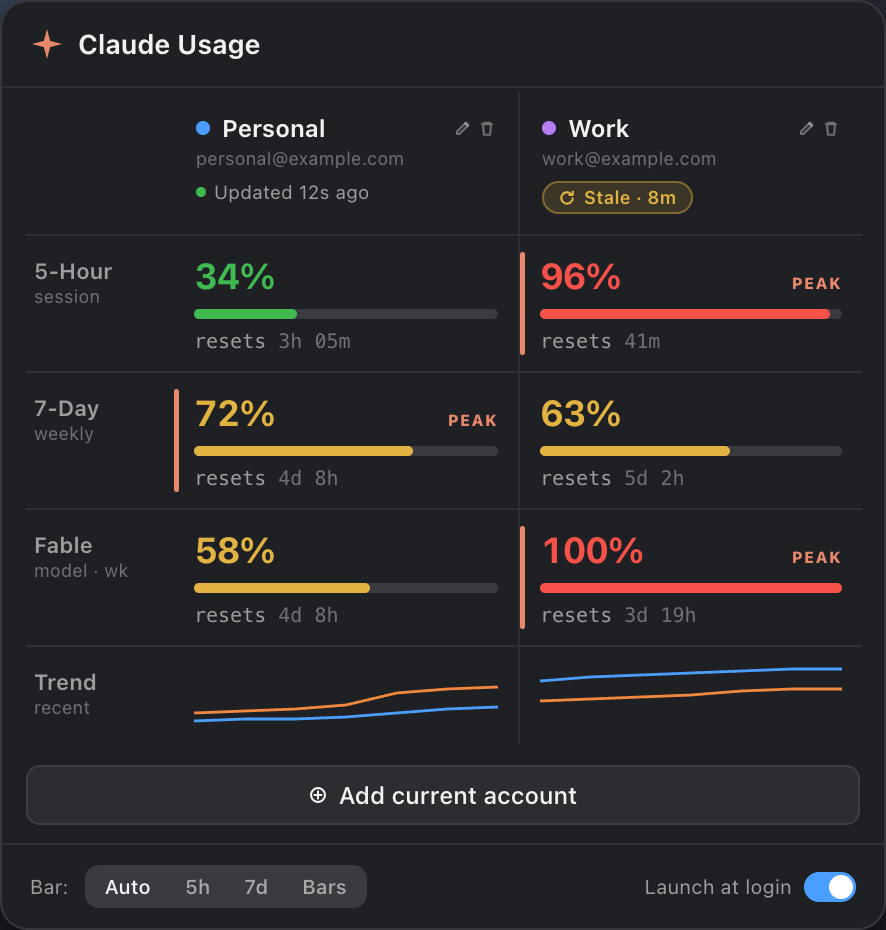

# ClaudeUsageBar

A lightweight macOS menu bar app that shows your Claude API usage limits at a glance. Zero dependencies — just Apple frameworks.

[](https://github.com/sam-pop/ClaudeUsageBar/actions/workflows/ci.yml)


## What It Does

ClaudeUsageBar sits in your menu bar showing a usage window and its reset countdown. Click to see full details — both usage windows, color-coded progress bars, live countdowns, and a 24-hour usage trend sparkline.

It reuses the OAuth credentials that Claude Code stores in the macOS Keychain and calls the Anthropic usage API directly — Claude Code doesn't need to be running.

**Key features:**

- Color-coded sparkle icon (green / yellow / red) based on usage level
- Live reset countdowns that tick every second
- Menu-bar display modes — **Auto** (whichever window is higher), **5h**, or **7d**
- Adaptive refresh rate — faster polling when usage is high
- Per-window system notifications at configurable thresholds (default 80% and 90%)
- Proactive token refresh before expiry, with a reactive 401/403 fallback
- Exponential backoff on transient network errors
- Persistent state — instant data on relaunch, no loading spinner

## Install

Requires **macOS 13+**, **Xcode 16+**, **XcodeGen** (`brew install xcodegen`), and **Claude Code** logged in at least once.

```bash
git clone https://github.com/sam-pop/ClaudeUsageBar.git
cd ClaudeUsageBar
make install    # builds + copies to /Applications
```

Or just `make run` to build and launch without installing.

## Usage

1. **Launch the app** — appears in your menu bar
2. **Allow Keychain access** — click **Always Allow** if prompted the first time (see [Troubleshooting](#troubleshooting))
3. **Allow notifications** — for usage threshold alerts
4. Click the menu bar icon for the full breakdown

| Target | Description |
|--------|-------------|
| `make build` | Build Release binary |
| `make run` | Build + launch |
| `make install` | Build + copy to `/Applications` |
| `make test` | Run the unit-test suite |
| `make clean` | Remove build artifacts |

## Screenshots

**Menu Bar**


**Popover**



## How It Works

```
Claude Code Keychain item ─┐
(one-time read/migration)  │
                           ▼
              KeychainService ──▶ App-owned Keychain item
                           ▲       "com.sam.ClaudeUsageBar"
      proactive + reactive │       (no-prompt reads, encrypted at rest)
        OAuth token refresh │
                           ▼
Anthropic API ◀── UsageAPIService (exponential backoff) ──▶ UsageViewModel
  GET /oauth/usage    │                                       │ adaptive timer
  {five_hour,         │                                       │ per-window alerts
   seven_day}         │                                       │ persistence
                      │                                       ▼
                      │                                 MenuBarExtra
                      │                                 ✦ 42% · 2h 15m
                      └─────────────────────────────── [Popover + sparkline]
```

**Credential storage.** On first run the app reads Claude Code's Keychain item once, then copies the OAuth credentials into its **own** Keychain item (`com.sam.ClaudeUsageBar`). Subsequent reads hit that app-owned item, so there are no recurring password prompts. Any legacy plaintext cache from earlier builds (`~/Library/Application Support/ClaudeUsageBar/.credentials.json`) is migrated into the Keychain and deleted the first time it's seen.

**Token refresh.** The access token is refreshed **proactively** shortly before it expires using the stored refresh token (no Keychain access needed). A **reactive** refresh on a 401/403 stays in place as a safety net. Only an explicit "Refresh token" button re-reads Claude Code's Keychain item, which is the only path that may prompt for a password.

**Resilience.** Transient failures (network errors, HTTP 5xx) are retried with exponential backoff (3 attempts, ~1s / 2s / 4s, jittered). Polling is adaptive: more frequent when usage is high, less frequent when it's low.

## Smart Features

| Feature | Detail |
|---------|--------|
| **Adaptive refresh** | 30s when usage ≥ 75%, 60s normal, 120s when < 25% |
| **Per-window notifications** | Separate alerts for the 5-hour and 7-day windows, e.g. "5-hour window at 82%" |
| **Configurable thresholds** | Defaults to 80% and 90%; override via `defaults` (see below) |
| **App-owned Keychain item** | Credentials cached in the app's own Keychain item — no recurring prompts, encrypted at rest |
| **Proactive token refresh** | Renews the access token before expiry; reactive 401/403 refresh as fallback |
| **Exponential backoff** | Retries transient errors with jittered backoff; auth errors take the refresh path |
| **24h sparkline** | Samples every 5min, up to 288 points with time axis labels |
| **Persistence** | Last known data + history saved to UserDefaults |
| **Graceful errors** | Shows stale data + error banner instead of a blank screen |

### Configuring notification thresholds

There's no settings UI for this yet. Set your own thresholds (integers, 1–100) with:

```bash
defaults write com.sam.ClaudeUsageBar notificationThresholds -array 80 90
```

Restart the app for the change to take effect. Invalid entries are ignored, values are clamped to 1–100, sorted, and de-duplicated; an empty or all-invalid list falls back to the default `[80, 90]`.

## Project Structure

```
ClaudeUsageBar/
├── project.yml                    # XcodeGen project spec
├── Makefile                       # Build automation
├── .github/workflows/ci.yml       # Build + test on macOS runners
├── ClaudeUsageBar/
│   ├── ClaudeUsageBarApp.swift    # @main entry point
│   ├── AppInfo.swift              # Shared version / User-Agent helper
│   ├── Models/
│   │   └── UsageData.swift        # API response + snapshot + history
│   ├── Logic/                     # Pure, unit-tested units
│   │   ├── MenuBarSelection.swift # Which window the menu bar shows
│   │   ├── ThresholdTracker.swift # Per-window threshold crossings + hysteresis
│   │   ├── HistoryBuffer.swift    # 5-min sampling, 288-point cap
│   │   └── RetryPolicy.swift      # Exponential-backoff calculator
│   ├── Services/
│   │   ├── KeychainService.swift  # Credential load/migrate + OAuth refresh
│   │   ├── CredentialStore.swift  # App-owned Keychain item
│   │   └── UsageAPIService.swift  # API client + error classification
│   ├── ViewModels/
│   │   └── UsageViewModel.swift   # State, timers, notifications
│   └── Views/
│       ├── MenuBarLabel.swift     # Color-coded ✦ + percentage + countdown
│       ├── ProgressBarView.swift  # Animated gradient bar with glow
│       ├── SparklineView.swift    # 24h trend graph with time axis
│       ├── UsageSectionView.swift # Card with bar + live countdown
│       └── UsagePopoverView.swift # Full popover layout
└── ClaudeUsageBarTests/           # Swift Testing unit tests
```

## Testing

The test target is an unhosted `bundle.unit-test` that compiles the app sources directly and exercises the pure logic units and model/service helpers with [Swift Testing](https://developer.apple.com/documentation/testing):

```bash
make test
```

CI runs the same build + test on every push and pull request (see the badge above).

## Troubleshooting

| Problem | Fix |
|---------|-----|
| "No OAuth token found" | Log into Claude Code once (`claude` → login flow) |
| HTTP 403 | Re-login: `claude /login` for a fresh token with correct scopes, then use **Refresh token** in the popover |
| One-time Keychain prompt after rebuilding from source | With ad-hoc signing (`CODE_SIGN_IDENTITY = "-"`), the app-owned Keychain item is bound to the previous build's code signature, so a freshly rebuilt binary may prompt once. The app self-heals: click **Always Allow** and it re-creates its item for the new build. |
| Repeated prompts while iterating locally | Sign with a stable, free **"Apple Development"** identity instead of ad-hoc signing so the item's ACL stays valid across rebuilds. |
| No notifications | Check System Settings → Notifications → ClaudeUsageBar; the popover also shows a "Notifications off" shortcut when disabled |

## License

MIT
